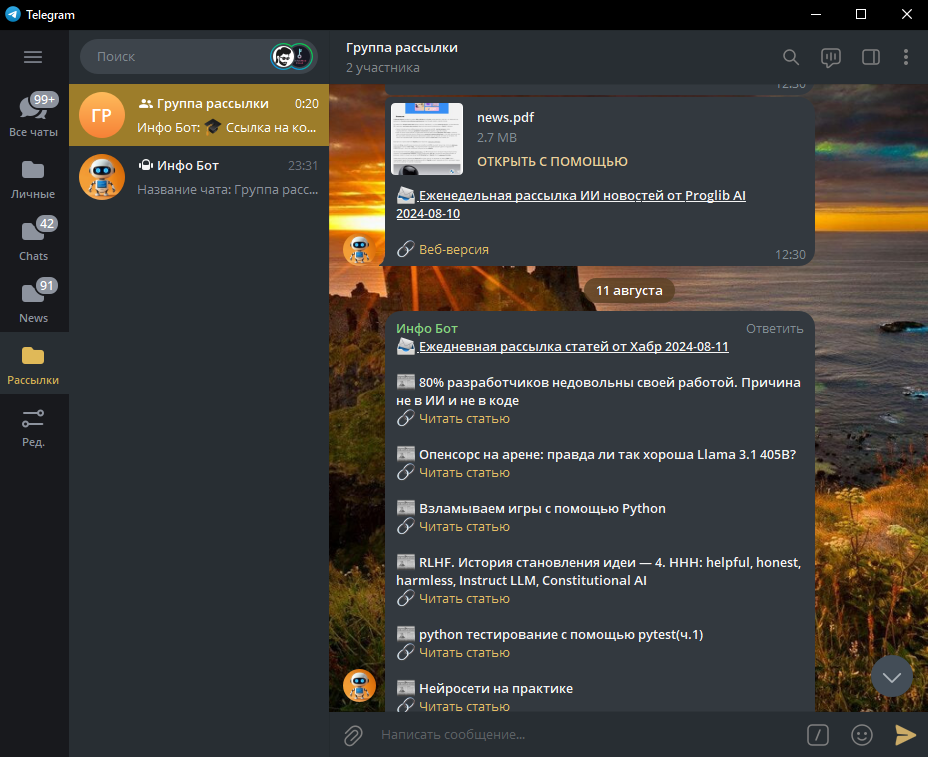
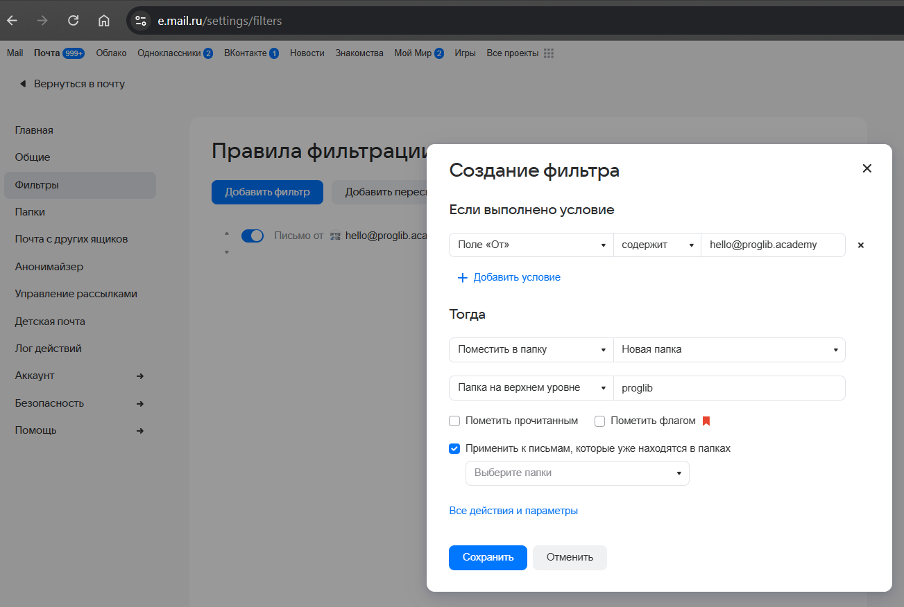
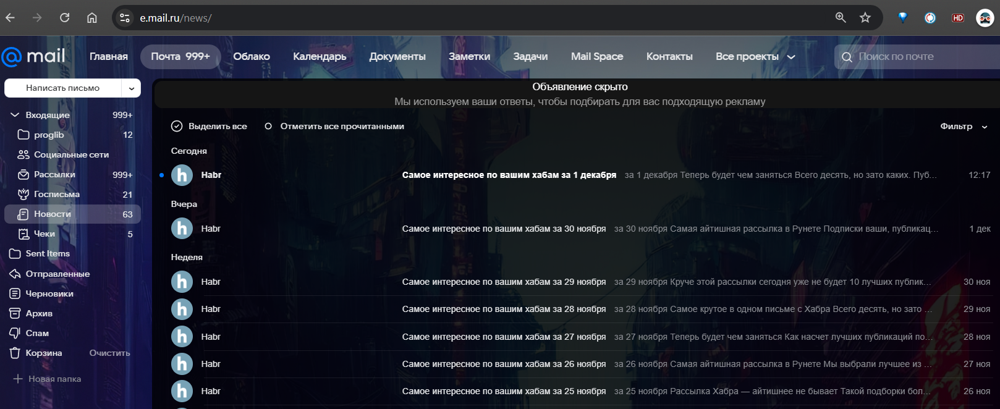
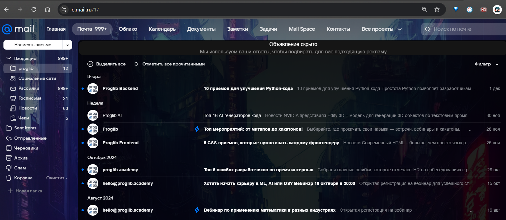

---
# Email to Telegram News Bot

[](https://github.com/sergey21000/telegram-news-bot/actions/workflows/daily_news.yml)

Telegram-бот, который автоматически получает новостные рассылки от Хабр и ~Proglib AI~ через email, обрабатывает их и пересылает в настроенные Telegram-чаты по заданному расписанию

В Google Colab <a href="https://colab.research.google.com/drive/1h4K3khHipUz-ExbK-TD1M0sewa02ggXL"></a> ноутбуке находится код бота с комментариями, процесс получения и парсинга писем из почты, деплой бота на Android и подключение терминала для удобной работы с телефоном, примеры использования библиотек для преобразования HTML в PDF


---
## 📋 Содержание

- 🚀 [Функционал](#-Функционал)
- 🏗 [Стек технологий](#-Стек-технологий)
- ⚙ [Подготовка к запуску](#-Подготовка-к-запуску)
- 🐍 [Запуск на Linux/Windows](#-Запуск-на-LinuxWindows)
- 📱 [Запуск на Android](#-Запуск-на-Android)
- 🔧 [Настройка рассылки](#-Настройка-рассылки)
- 🛠 [Дополнительные настройки рассылки](#-Дополнительные-настройки-рассылки)


---
## 🚀 Функционал

- Возможность установки расписания для всех типов рассылок
- Рассылка новостей из почтовой рассылки от Хабр в текстовом формате
- ~Рассылка статьи из почтовой рассылки от Proglib AI в формате PDF и ссылкой на веб-версию статьи~
- Возможность рассылки самописных напоминаний
- Возможность создания своих конфигов рассылки из электронной почты
- Возможность рассылки путем запуска скрипта

Как работает бот:
1) Письма с рассылками новостей приходят на электронную почту mail.ru
2) При старте бота запускается планировщик, который активирует парсинг почты по расписанию
3) Парсер получает содержимое писем и формирует из них текст для рассылки, для рассылки от Хабр это просто текст со списком новостей и ссылками на них, ~для рассылки от Proglib AI это web-ссылка на статью и PDF документ с этой статьей~
4) Рассылка производится по указанным в конфигах чатам
5) Можно настроить рассылку своих кастомных сообщений
6) Можно совершить рассылки путем запуска скрипта `run_send.py`, удобно когда не нужно чтобы бот работал в постоянном режиме, а автоматически запускался через любой планировщик

<details>
<summary>Скриншот рассылки от Хабр и Progliob AI</summary>


</details>


---
## 🏗 Стек технологий

- [python](https://www.python.org/) >= 3.10
- [aiogram](https://github.com/aiogram/aiogram) для написания Telegram бота
- [aioimaplib](https://github.com/bamthomas/aioimaplib) для асинхронной работы с почтовым ящиком
- [beautifulsoup4](https://pypi.org/project/beautifulsoup4/) для парсинга содержимого писем
- [WeasyPrint](https://github.com/Kozea/WeasyPrint) для преобразования веб страницы с новостями от Proglib AI в PDF документ

Работоспособность приложения проверялась на следующих ОС и версиях Python
- Ubuntu 22.04, python 3.10.12
- Windows 10, python 3.12.2
- Android 11 (MIUI 12), Termux, python 3.12.7
- Android 9, Termux, python 3.11.9


---
## ⚙ Подготовка к запуску

**1) Клонирование репозитория**  
```sh
git clone https://github.com/sergey21000/telegram-news-bot.git
cd telegram-news-bot
```

**2) Регистрация бота, получение пароля почты**  

Создать файл `.env`
```env
BOT_TOKEN=your_bot_token
MAIL_ADDRESS=your_mail_adress@mail.ru
MAIL_PASSWORD=your_mail_password
```

Заполнить файл `.env` следующим содержимым

> [!IMPORTANT]  
**1)** В переменную `BOT_TOKEN` записать токен бота, полученный у https://t.me/BotFather  
Для получения токена отправить боту https://t.me/BotFather команду /newbot, ввести любое имя бота, затем ввести имя пользователя бота (должно заканчиваться на `bot`), затем скопировать токен бота, записать в переменную `BOT_TOKEN`  
Нажать на никнейм бота и нажать кнопку запустить, начав таким образом диалог с ботом

> [!IMPORTANT]  
**2)** В переменную `MAIL_ADDRESS` записать свой адрес почты https://e.mail.ru/  

> [!IMPORTANT]  
**3)** Создать пароль для внешних приложений почты и записать в переменную `MAIL_PASSWORD`  
Для создания пароля перейти на https://e.mail.ru/inbox, нажать на кружок аккаунта в правом верхнем углу - `Пароль и безопасность` - `Пароли для внешних приложений` - `Создать` - ввести любое название - выбрать `Только чтение и удаление писем в Почте`

**3) Подписка на рассылку новостей**

В качестве источников новостей можно выбрать Хабр и ~Proglib AI~ (оба источника, один из них или вообще ни одного, если бот преназначен для рассылки своих напоминаний)

<ins><b>Рассылка от Хабр</b></ins>

Чтобы подписаться на рассылку от Хабр, нужно зайти на https://habr.com/, зарегистрироваться и войти в аккаунт, перейти в настроки уведомлений https://habr.com/ru/settings/notifications/ и выбрать частоту рассылки дайджеста внизу (например Каждый день)  
Подписаться на интересующие темы для рассылки можно на этой странице
https://habr.com/ru/feed/settings/

Конфиги уже настроены чтобы парсить рассылку от Хабр, которая автоматически приходит в папку писем Новости

<ins><b>Рассылка от Proglib AI</b></ins>


<!--- comment -->
> [!IMPORTANT]  
На данный момент рассылка от Proglib AI прекращена (возможно временно), данный шаг можно считать неактуальным

~Подписаться на рассылку от Proglib AI можно здесь
https://proglib.academy/ai-newsletter~

~Затем нужно настроить чтобы письма от Proglib AI приходили в определенную папку почты с названием `proglib`  
Для этого нужно перейти на https://e.mail.ru/inbox, нажать `Настройки` в левом нижнем углу - `Все настройки` - `Фильтры` - `Добавить фильтры`  
В настройках фильтра записать в `Поле от содержит` строку `hello@proglib.academy`  
В `Тогда` `переместить в папку` нажать на `Входящие` и выбрать `Новая папка`, и в поле `Папка на верхнем уровне` написать название `proglib`~


<details>
<summary>Скриншот настроек фильтрации почты</summary>


</details>


<details>
<summary>Скриншот папки писем Новости</summary>


</details>


<details>
<summary>Скриншот папки писем proglib</summary>


</details>


---
## 🐍 Запуск на Linux/Windows

**1) Создание и активация виртуального окружения (опционально)**

- *Linux*
  ```sh
  python3 -m venv env
  source env/bin/activate
  ```

- *Windows CMD*
  ```sh
  python -m venv env
  env\Scripts\activate
  ```

- *Windows PowerShell*
  ```powershell
  python -m venv env
  env\Scripts\activate.ps1
  ```

**3) Установка зависимостей**  

```sh
pip install -r requirements.txt
```

**4) Запуск бота**  

- *Linux*
  ```sh
  python3 run_bot.py
  ```

- *Windows*
  ```sh
  python run_bot.py
  ```

Запуск валидации необходимого функционала перед запуском бота (опционально)
```sh
python -m configs.validation
```

Если в процессе валидации ошибок не возникло то в терминале будет надпись
```
Все функции валидации завершены без ошибок
```

Отдельно запустить скрипт рассылки
```sh
# все рассылки из конфига Config
python run_send.py

# только рассылки, полученные из электронной почты (конфиги класса SendEmailConfig)
python run_send.py --email

# только рассылки напоминаний (конфиги класса SendReminderConfig)
python run_send.py --reminder
```

**5) Дополнительная установка WeasyPrint (опционально)**

> [!NOTE]
> Если не нужно присылать PDF версию статьи с рассылкой от Proglib то установку WeasyPrint делать не нужно  
В таком случае будет приходить только ссылка на новости от Proglib

[Документация](https://doc.courtbouillon.org/weasyprint/stable/first_steps.html#installation) по установке `WeasyPrint`  

<ins><b>Установка WeasyPrint на Windows</b></ins>

Библиотека `Pango` нужна для работы библиотеки `WeasyPrint`, которая используется для преобразования веб-страницы с новостями от Proglib AI в PDF документ

1. Установить MSYS2, запустить (если случайно закрыли то находится в Все программы - MSYS2 - MSYS2 UCRT 64)  
[Документация](https://www.msys2.org/#installation) по установке MSYS2  

2. Установить `Pango`
```sh
pacman -S mingw-w64-x86_64-pango
```

3. Установить `WeasyPrint`
```sh
pip install weasyprint==63.0
```

<ins><b>Установка WeasyPrint на Linux</b></ins>

На Ubuntu `Pango` устанавливается автоматически вместе с `WeasyPrint`, если на других Linux это не так то нужно установить `Pango` для своей системы по инструкции  

1. Установить `WeasyPrint`
```sh
pip install weasyprint==63.0
```


---
## 📱 Запуск на Android

[Инструкции](https://github.com/sergey21000/telegram-news-bot/blob/main/README_Android.md) по запуску бота на Android


---
## 🔧 Настройка рассылки

**1) Получение своего ID в Telegram (необязательный шаг для рассылки в группы)**
 
Чтобы узнать свой ID, нужно запустить бота, полученного на шаге [Подготовка к запуску](#-Подготовка-к-запуску) (`Регистрация бота`) и отправить ему команду /getid  
Бот ответит сообщением с полем `ID чата`, скопировать его и вставить в файл `configs/chats_settings.py` в переменную `ADMIN_CHAT`, например
```python
ADMIN_CHAT: AdminChatConfig = AdminChatConfig(chat_id=123456789)
```
Так же узнать свой ID можно, написав боту https://t.me/getmyid_bot команду /start

**2) Настройка чатов для рассылки**

<i><ins>Далее следуют два варианта настройки рассылки - чтобы бот присылал рассылку в лс или чтобы он присылал ее в группу</i></ins>

1. Настройка для рассылки в лс

Для того чтобы бот присылал рассылку в лс, передать созданный выше `ADMIN_CHAT` в список `chats` при инициализации конфига рассылки
```python
habr_email_config = SendEmailConfig(
    chats=[ADMIN_CHAT],
	# остальные параметры
```

2. Настройка для рассылки в группу/группы

Если нужно чтобы бот отправлял рассылку в определенную группу, нужно его добавить в эту группу и сделать админом  
Затем запустить бота, и отправить команду /getid в группу  
Бот пришлет сообщение с `ID чата`, который нужно добавить в словарь `CHATS_TO_SEND` в файле `configs/chats_settings.py`, например
```python
# формат: 
CHATS_TO_SEND: dict[str, ChatConfig] = dict(
    CHAT_NAME=ChatConfig(chat_id=123456789),
    ...,
)
```

Список чатов можно пополнять другими ID, главное что если это группа то бот должен быть в ней админом, а если это ID чата личной переписки, то человек должен первый написать боту

Далее можно запускать бота и ожидать рассылки
```sh
python run_bot.py
```

Или отдельно запустить скрипт рассылки
```
# все рассылки из конфига Config
python run_send.py

# только рассылки, полученные из электронной почты (конфиги класса SendEmailConfig)
python run_send.py --email

# только рассылки напоминаний (конфиги класса SendReminderConfig)
python run_send.py --reminder
```

При текущих настройках рассылка новостей от Хабр приходит каждый день в 12:30  
~Рассылка от Proglib AI приходит каждую субботу в 12:30~


---
## 🛠 Дополнительные настройки рассылки

<details>
<summary>Дополнительные настройки рассылки</summary>


**1) Настройка/добавление/удаление конфигов рассылки**

Конфиги рассылки находятся в классе `Config` в файле `configs/send_config.py`

Конфиг `habr_email_config` отвечает за отправку рассылки от Хабр  
~Конфиг `proglib_email_config` отвечает за отправку рассылки от Proglib AI~  


Письма от Хабр приходят в папку почты Новости, она уже установлена в конфиге рассылки `habr_email_config` в файле `configs/send_config.py` в строке `mail_folder='INBOX/News'`  
~Письма от Proglib AI приходят в папку почты proglib (после настройки на шаге [Подготовка к запуску](#-Подготовка-к-запуску)), она установлена в конфиге рассылки `proglib_email_config` в файле `configs/send_config.py` в строке `mail_folder='INBOX/proglib'`~

Для отключения конфига рассылки можно закомментировать его или установить `is_active=False`  
Настроить расписание рассылки можно в экземпляре класса `ScheduleKwargsConfig`, который передается в каждый конфиг рассылки

При текущих настройках рассылка новостей от Хабр приходит каждый день в 12:30  
Рассылка от Proglib AI приходит каждую субботу в 12:30
```python
schedule_config = ScheduleKwargsConfig(
	day_of_week='*',  # дни рассылки (mon,tue,wed,thu,fri,sat,sun)
	hour=12,  # часы рассылки
	minute=30,  # минуты рассылки
	end_date='2025-02-01',  # дата окончания рассылки
	timezone=TIMEZONE,  # часовой пояс
)
```

Если рассылка за сегодня еще не пришла на почту, то парсер делает 10 повторных попыток каждые полчаса  
Количество и интервал попыток настраиваются в классе `SendSettingsConfig` в файле `configs/send_config.py`  
```python
class SendSettingsConfig:
    '''Конфиг настройки параметров рассылки'''
    max_attempts: int = 10  # кол-во попыток выполнения функции получения рассылки
    delay_seconds: int = 1800  # интервал между попытками, сек
    send_errors_to_admin: bool = True  # отправлять админу инфо о том что попытки исчерпаны
    send_pdf_to_proglib: bool = True  # отправлять PDF вместе с рассылкой Proglib
```

При достижении 5 неудачных попыток админу в лс придет сообщение об ошибке  
Отключить это можно в том же классе `SendSettingsConfig` в параметре `send_errors_to_admin`  
В параметре `send_pdf_to_proglib` можно отключить работу с PDF - бот будет присылать только ссылку на страницу с рассылкой от Proglib

Для активации конфига с напоминанием нужно раскомментировать конфиг `test_reminder_config` и установить свое раписание  
Данный конфиг предназначался чтобы отправлять в чат студентов ссылку для входа на платформу для вебинаров и время встречи как напоминание о том что сегодня встреча  

Отключить логирование ошибок в файл можно редактировав строку `LOG_TO_FILE = False` в файле `bot/setup_logging.py`

**2) Пример добавления своего конфига для напоминаний**

Пример создания своего простого конфига со своим текстом рассылки, который отправляет сообщение каждый понедельник и четверг в 12:00  

1. Создать конфиг в файле `config/config_classes.py` и отнаследовать его от класса `SendBaseConfig`, например
```python
@dataclass
class MyReminderConfig(SendBaseConfig):
    '''Конфиг для отправки напоминаний'''
    message_to_send: str
```

2. Добавить импорт в файле `configs/send_config.py`
```python
from configs.config_classes import MyReminderConfig
```

3. Инициализировать новый конфиг в классе `Config` в файле `configs/send_config.py`  
Название конфига должно заканчиваться на `_reminder_config`
```python
class Config(BaseConfig):
    '''Конфиг с конфигами для рассылок'''
	# ================= ПРИМЕР КОНФИГА ДЛЯ НАПОМИНАНИЙ ===================
    my_reminder_config = MyReminderConfig(
        schedule_kwargs_config=ScheduleKwargsConfig(
            day_of_week='mon,thu',  # дни рассылки (mon,tue,wed,thu,fri,sat,sun)
            hour=12,  # часы рассылки
            minute=00,  # минуты рассылки
            end_date='2026-02-01',  # дата окончания рассылки
            timezone=TIMEZONE,  # часовой пояс
        ),
        admin_chat=ADMIN_CHAT,  # чат админа для отправки отчетов об ошибках
        chats=[CHATS_TO_SEND.MY_CHAT_1, MY_CHAT_2],  # чаты для рассылки
        
        # функция получения сообщения для рассылки
        # принимает текущий экземпляр конфига MyReminderConfig
		# может быть любой самописной функцией, лямбда для упрощенного примера
        parse_func=EmailParser.get_reminder_send,
		
        # доп аргументы, присущие конкретному конфигу
        message_to_send='Здесь сообщение-напоминание для отправки по расписанию'
    )
```

Функция, которая передается в параметр `parse_func=` может быть любой, при этом она должна быть асинхронной, принимать на вход экземпляр текущего конфига и возвращать итоговый текст для отправки  
В данном примере функция `parse_func=EmailParser.get_reminder_send` просто извлекает из текущего конфига атрибут `message_to_send` в котором содержится текст сообщения для рассылки и возвращает его


**3) Пример добавления своего конфига для парсинга и рассылки из почты**

Для добавления своего конфига, который будет парсить папку писем, нужно в главный конфиг `Config` добавить `SendEmailConfig`, в котором описать:
 - `schedule_kwargs_config` - конфиг `ScheduleKwargsConfig` c расписанием отправки рассылки
 - `admin_chat` - чат админа куда нужно отправлять инфу об ошибках отправки рассылки
 - `chats` - список чатов куда нужно отправлять рассылку
 - `parse_func` - любая асинхронная функция которая возвращает итоговый текст для рассылки
 - `target_email_sender` - имя отправителя письма, которое нужно парсить
 - `mail_folder` - папка писем которую нужно парсить

Для написания своей `parse_func` можно воспользоваться готовыми функциями из класса `EmailParser` модуля `bot/parser`, в которых реализован базовый функционал работы с почтой

```python
class Config(BaseConfig):
    '''Конфиг с конфигами для рассылок'''
	# ================= ПРИМЕР КОНФИГА ДЛЯ РАССЫЛКИ СООБЩЕНИЙ ИЗ ПОЧТЫ ========
    my_reminder_config = MyReminderConfig(
        schedule_kwargs_config=SendEmailConfig(
            day_of_week='*',  # дни рассылки (mon,tue,wed,thu,fri,sat,sun)
            hour=12,  # часы рассылки
            minute=00,  # минуты рассылки
            end_date='2025-02-01',  # дата окончания рассылки
            timezone=TIMEZONE,  # часовой пояс
        ),
        admin_chat=ADMIN_CHAT,  # чат админа для отправки отчетов об ошибках
        chats=[CHATS_TO_SEND.MY_CHAT_1, MY_CHAT_2],  # чаты для рассылки
        
        # асинхронная функция которая принимает текущий конфиг и возвращает текст рассылки
        parse_func=EmailParser.parse_func,
    )
```

</details>

## Лицензия

Этот проект лицензирован на условиях лицензии [MIT](./LICENSE).


