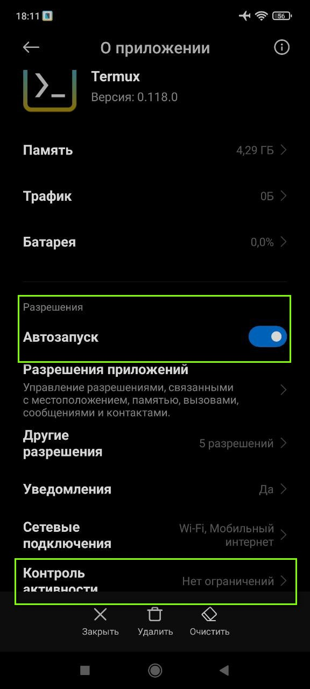
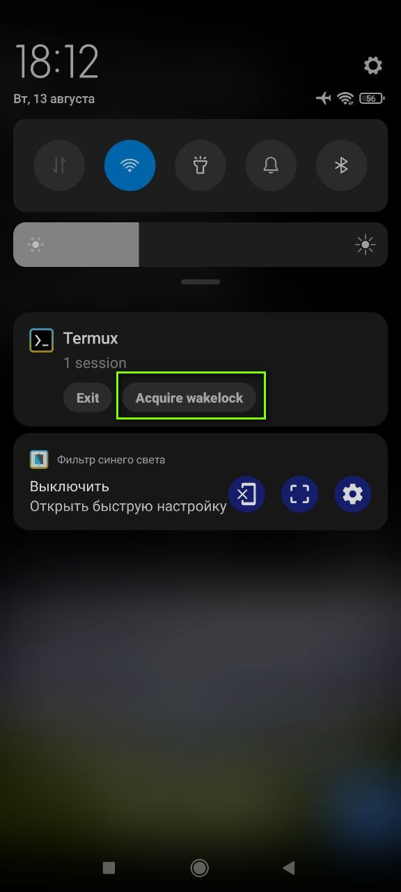
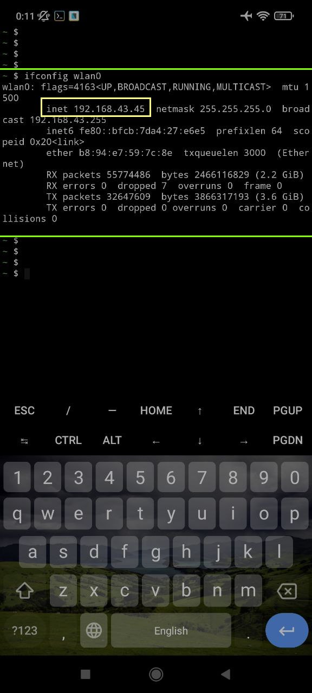

---
# 📱 Запуск бота на Android


---
## 📋 Содержание

- [Установка Termux и Python на Android](#Установка-Termux-и-python-на-Android)
- [Установка WeasyPrint на Android (опционально)](#Установка-WeasyPrint-на-Android-опционально)
- [Запуск бота на Android](#Запуск-бота-на-Android)
- [Дополнительно](#Дополнительно)
  - [Подключение из ПК к телефону по SSH через терминал](#Подключение-из-ПК-к-телефону-по-SSH-через-терминал)
  - [Подключение из ПК к телефону по SSH через MobaXterm](#Подключение-из-ПК-к-телефону-по-SSH-через-MobaXterm)

---
## Установка Termux и Python на Android

**1) Загрузить и установить `Termux`**  

Загрузить `apk` файл с [GitHub](https://github.com/termux/termux-app/releases ) или [Fdroid](https://f-droid.org/ru/packages/com.termux/)

После установки `Termux` долгий тап на значок `Termux` - Инфо о приложении - Разрешения - поставить разрешение на доступ к памяти

**2) Выполнить команду чтобы дать доступ `Termux` к памяти телефона**

```
termux-setup-storage
```
Дать необходимые разрешения если спросит

Проверить что `Termux` имеет доступ к памяти телефона
```
ls /sdcard
```

**3) Обновить репозиторий и установить python**

```
pkg update && pkg upgrade -y
pkg install -y python python-pip
pip install -U pip
```

Проверить что python установлен
```
python -V
```
На момент декабря 2024г устанавливается версия 3.12.7

Установить другие часто используемые библиотеки (`rust` необходим для установки `aiogram` на `Termux`)
```
pkg install -y wget nano git openssh rust
```


---
## Установка WeasyPrint на Android (опционально)

> [!NOTE]  
> Если не нужно присылать PDF версию статьи с рассылкой от Proglib то этот шаг можно пропустить  
В таком случае будет приходить только ссылка на новости от Proglib

Для работы `WeasyPrint` требуются библиотеки `Pillow` и `Pango` 

**1) Установка `Pillow` в `Termux` (требуется версия `Pillow<11,>=9.1.0')**  

Проверить устанавливается ли `Pillow` обычным способом
```
pip install Pillow==10.4.0
```
Если ошибок нет, то перейти в шагу 2, если ошибка, то воспользоваться нижеописанным способом (взято из [stackoverflow](https://stackoverflow.com/a/63105934/14132503))

Подготовка к установке `Pillow` 
```
pkg update
pkg install libjpeg-turbo
```

Установка `Pillow` на 64 битных ОС
```
LDFLAGS="-L/system/lib64/" CFLAGS="-I/data/data/com.termux/files/usr/include/" pip install Pillow==10.4.0
```

Установка `Pillow` на 32 битных ОС
```
LDFLAGS="-L/system/lib/" CFLAGS="-I/data/data/com.termux/files/usr/include/" pip install Pillow==10.4.0
```

Узнать архитектуру можно командой
```
uname -m
```
Если показывает `aarch64`/`x86_64` то это 64 бит, если `armv7l`/`armv8l`/`i686`/`x86` то 32 бит  
(`armv8l` это 64 бит но с активным режимом 32 бит поэтому ставим как на 32)


**2)Установка Pango в `Termux`**

```
pkg install pango
```

**3) Установка WeasyPrint в `Termux`**

```
pip install weasyprint==63.0
```

Проверка установок `Pillow`, `Pango` и `Termux`
```
pip list
pango-view --version
weasyprint --info
```


---
## Запуск бота на Android

**1) Клонирование репозитория и установка зависимостей**

Переход в стандартную папку памяти телефона, создание папки `/info_bot`, клонирование репозитория, создание вирутального окружения (опционально) и установка зависимостей
```
cd /sdcard
mkdir -P info_bot
git clone https://github.com/sergey21000/telegram-email-news-bot.git

python -m venv env
source env/bin/activate

pip install -U pip
pip install -r requirements.txt
```

**3) Запуск бота**

```
python main.py
```

**4) Настроить Android чтобы он не закрывал `Termux` (опционально, для случая если бот будет деплоиться на телефоне)**

Для этого в зависимости от версии Android нужно найти все настройки, которые отвечают за закрытие приложения системой Android (оптимизация батареи, настройка работы программ в фоновом режиме)  
Например на Android 11 (MIUI 12) нужно удерживать тап на `Termux` - О приложении, включить автозапуск и установить Констроль активности - Без ограничений  

<details>
<summary>Скриншот Настроек Контроля активности</summary>

</details>

Так же в шторке уведомлений Android там где висит `Termux` нужно нажать `Acquire wakelock`, переключив таким образом `Termux` в режим в котором он не будет отключаться    
Еще можно нажать на недавние приложения - тап на окошко `Termux` и нажать на замок чтобы закрепить приложение  

<details>
<summary>Скриншот Acquire wakelock Termux</summary>

</details>


---
## Дополнительно


---
### Подключение из ПК к телефону по SSH через терминал

**Подключение из ПК к телефону по SSH через терминал**  

[Документация](https://wiki.termux.com/wiki/Remote_Access) и [статья](https://axenov.dev/termux-настроить-доступ-по-ssh-между-android-и-ubuntu/) по удаленному подключению к `Termux` 

> [!WARNING]  
Пк и телефон должны быть подключены к одной сети  
IP адрес телефона может динамически меняться при новых подключениях  

**1) Установка SSH и редактора nano на `Termux`**
```
pkg install nano openssh
```

**2) Генерация SSH ключей на ПК**
```
ssh-keygen
```
Далее нажимать `Enter` пока не будет написано что ключи сгенерированы  
Ключи представляют из себя публичную `id_rsa.pub` и приватную `id_rsa` части  
Приватный ключ никому не надо показывать, публичный ключ можно показывать кому угодно и его содержимое нужно будет скопировать на телефон  
Ключи сохраняются на Windows по пути `C:\Users\ИМЯ_ПОЛЬЗОВАТЕЛЯ\.ssh\`  
Ключи сохраняются на Linux по пути `~/.ssh/`  

**3) Вывести содержимое публичного ключа `id_rsa.pub` на ПК**
 - Windows
```
cat %USERPROFILE%\.ssh\id_rsa.pub
```
 - Linux
```
cat ~/.ssh/id_rsa.pub
```

**4) Скопировать содержимое ключа и любым удобным способом перекинуть на телефон (например через Избранное Telegram)**  
Затем в телефоне скопировать содержимое и вставить его в файл `~/.ssh/authorized_keys` в телефоне  
Для этого в терминале `Termux` открываем редактор nano
```
nano ~/.ssh/authorized_keys
```
Удерживаем тап по экрану - вставляем содержимое, и с помощью клавиатуры `Termux` нажимаем `Ctrl+S` и `Ctrl+X`

**5) Остановка и запуск службы SSH в `Termux`**
```
pkill sshd
sshd
```

**6) Узнать IP адрес телефона Android**
```
ifconfig
```
IP адрес написан в разделе `wlan0`, после слова `inet`, например `192.168.43.45`  
Название может быть другое, например `wlan1` и тд  
Можно сразу посмотреть инфо о `wlan0` командой
```
ifconfig wlan0
```

**7) Подключение из ПК с телефону - к IP адресу который узнали командой выше**
```
ssh 192.168.43.45 -p 8022
```
Перед подключением убедиться что служба SSH в `Termux` запущена (нужно запускать ее при каждом перезапуске `Termux`)
```
sshd
```

**8) Отключить авторизацию по паролю в `Termux` чтобы можно было подключаться только через SSH (опционально)**  
```
nano $PREFIX/etc/ssh/sshd_config
```
Добавить или редактировать строку
```
PasswordAuthentication no
```

*Дополнительные команды*  

Отключиться от телефона
```
exit
```
Завершить работу службы SSH в `Termux`
```
pkill sshd
```

<details>
<summary>Скриншот команды `ifconfig wlan0` с IP адресом телефона</summary>

</details>


---
### Подключение из ПК к телефону по SSH через MobaXterm

**Подключение к телефону через SSH через с помощью программы MobaXterm с файловым менеджером**

> [!WARNING]  
Пк и телефон должны быть подключены к одной сети  
IP адрес телефона может динамически меняться при новых подключениях  

---
Установить на ПК [MobaXterm](https://mobaxterm.mobatek.net/)

Как узнать IP адрес телефона и создать SSH ключи описано в предыдущем разделе  
Там же описано как переместить публичную часть ключа в телефон - это необходимо для подключения

**Процесс подключения**

В левом верхнем углу программы нажать на `Session` -> `SSH` -> в поле `Remote host` вбить IP адрес телефона, в поле `Port` - 8022  
Перейти на вкладку `Advancrd SSH settings` -> поставить галку на `Use private key` -> нажать на значок выбора файла и указать путь к приватному ключу (например `C:\Users\ИМЯ_ПОЛЬЗОВАТЕЛЯ\.ssh\`)  
Затем нажать ок и будет произведена попытка подключения  
Во вкладке `Bookmark settings` можно задать удобное название для подключеня (опционально)  

<details>
<summary>Запуск бота через MobaXterm</summary>


</details>

